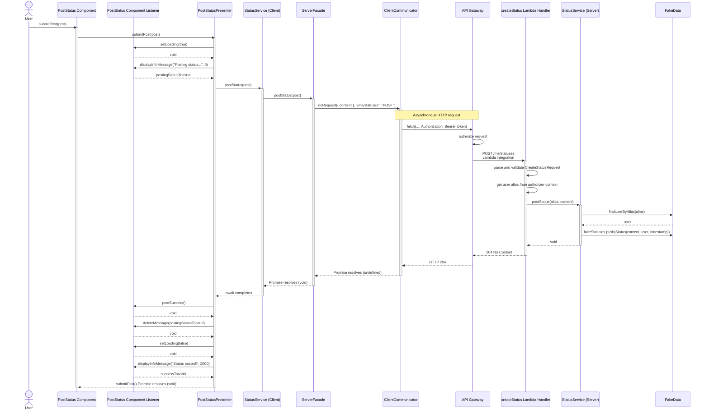

# Successful Status Submission Sequence

```mermaid
sequenceDiagram
    actor User
    participant PostStatus as PostStatus Component
    participant Listener as PostStatus Component Listener
    participant Presenter as PostStatusPresenter
    participant ClientStatus as StatusService (Client)
    participant Facade as ServerFacade
    participant Communicator as ClientCommunicator
    participant Gateway as API Gateway
    participant Handler as createStatus Lambda Handler
    participant ServerStatus as StatusService (Server)
    participant FakeData as FakeData

    User->>PostStatus: submitPost(post)
    activate PostStatus
    PostStatus->>Presenter: submitPost(post)
    activate Presenter

    Presenter->>Listener: setLoading(true)
    Listener-->>Presenter: void
    Presenter->>Listener: displayInfoMessage("Posting status...", 0)
    Listener-->>Presenter: postingStatusToastId

    Presenter->>+ClientStatus: postStatus(post)
    ClientStatus->>+Facade: postStatus(post)
    Facade->>+Communicator: doRequest({ content }, "/me/statuses", "POST")

    Note over Communicator,Gateway: Asynchronous HTTP request
    Communicator->>Gateway: fetch(..., Authorization: Bearer token)
    Gateway->>Gateway: authorize request
    Gateway->>+Handler: POST /me/statuses<br/>Lambda integration

    Handler->>Handler: parse and validate CreateStatusRequest
    Handler->>Handler: get user alias from authorizer context
    Handler->>+ServerStatus: postStatus(alias, content)
    ServerStatus->>FakeData: findUserByAlias(alias)
    FakeData-->>ServerStatus: user
    ServerStatus->>FakeData: fakeStatuses.push(Status(content, user, timestamp))
    ServerStatus-->>-Handler: void
    Handler-->>-Gateway: 204 No Content
    Gateway-->>Communicator: HTTP 204

    Communicator-->>-Facade: Promise resolves (undefined)
    Facade-->>-ClientStatus: Promise resolves (void)
    ClientStatus-->>-Presenter: await completes

    Presenter->>Listener: postSuccess()
    Listener-->>Presenter: void
    Presenter->>Listener: deleteMessage(postingStatusToastId)
    Listener-->>Presenter: void
    Presenter->>Listener: setLoading(false)
    Listener-->>Presenter: void
    Presenter->>Listener: displayInfoMessage("Status posted!", 2000)
    Listener-->>Presenter: successToastId

    Presenter-->>PostStatus: submitPost() Promise resolves (void)
    deactivate Presenter
    deactivate PostStatus
```
